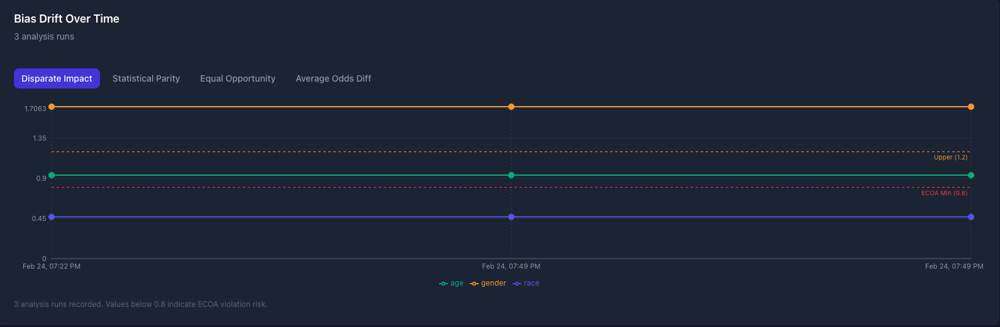
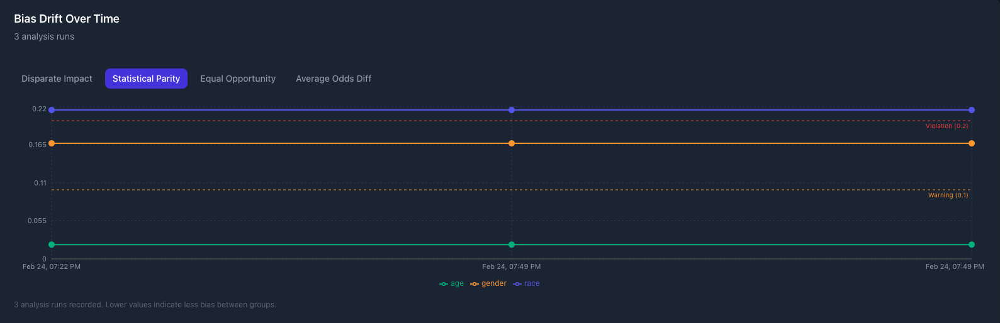
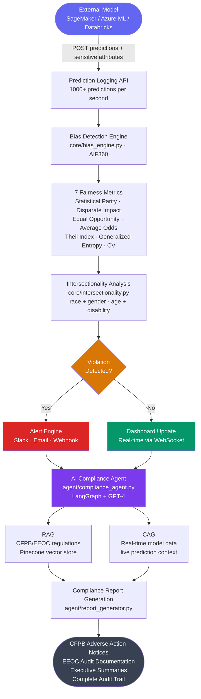

# BiasGuard — Production AI Fairness Monitoring Platform

[](https://opensource.org/licenses/MIT)
[](https://www.python.org/downloads/)
[](https://fastapi.tiangolo.com)
[](https://reactjs.org)
[](https://cloud.google.com/kubernetes-engine)

BiasGuard monitors AI models already deployed in production to ensure CFPB, EEOC, and EU AI Act compliance. Built for FinTech BNPL companies, lending platforms, and HR tech to detect bias before regulators do.

**Stop training models. Start monitoring the ones you already have.**

---

## Screenshots

**Disparate Impact Analysis**


**Statistical Parity**


**Intersectionality Analysis**


**Model Registration**


**[View Sample Compliance Report (PDF)](./report_model_2d5eff13694f_20260224_145101.pdf)**

---

## Problem

Companies have ML models already deployed — trained by their data science teams, running in production, making decisions that affect real people. But they have no visibility into whether those models are discriminating against protected classes until they get sued or fined.

- CFPB fines: $1M - $100M+ for biased lending models
- Class-action discrimination suits cost millions in legal fees
- Models pulled from production cause direct revenue loss

BiasGuard monitors production models 24/7 and surfaces violations before regulators do.

---

## Architecture



---

## How It Works

**1. Register your model** — point BiasGuard at any model running on SageMaker, Azure ML, Databricks, or your own infrastructure.

**2. Log predictions** — send predictions and sensitive attributes to the BiasGuard API as your model runs. Handles 1000+ predictions per second.

**3. Bias detection runs automatically** — AIF360 computes 7 fairness metrics including intersectionality analysis across protected attribute combinations.

**4. Violations trigger alerts** — Slack, email, or webhook notifications when thresholds are breached.

**5. AI compliance agent answers questions** — LangGraph-based agent with RAG over CFPB/EEOC regulation knowledge base answers natural language compliance queries against your live model data.

**6. Reports generated on demand** — CFPB adverse action notices, EEOC statistical evidence, executive summaries.

---

## Tech Stack

| Layer | Technology |
|---|---|
| Bias Detection | AIF360 (IBM), 7 fairness metrics |
| AI Compliance Agent | LangGraph, GPT-4, Pinecone (RAG) |
| Backend | FastAPI, SQLAlchemy, PostgreSQL, Redis |
| Frontend | React 19, TypeScript, Tailwind CSS, Recharts |
| Real-time | WebSockets |
| Infrastructure | Docker, Kubernetes (GKE), Nginx |
| Model Registry | External — SageMaker, Azure ML, Databricks |

---

## Fairness Metrics

| Metric | Description | Compliant Range | Regulation |
|---|---|---|---|
| Disparate Impact | Ratio of favorable outcomes | [0.8, 1.25] | EEOC Four-Fifths Rule |
| Statistical Parity | Difference in approval rates | [-0.1, 0.1] | CFPB Guidance |
| Equal Opportunity | True positive rate parity | [-0.1, 0.1] | EEOC Title VII |
| Average Odds | TPR and FPR parity | [-0.1, 0.1] | EU AI Act |
| Theil Index | Income inequality analogue for predictions | < 0.1 | Internal threshold |
| Generalized Entropy | Distribution-level fairness | < 0.1 | Internal threshold |
| Coefficient of Variation | Spread of outcomes across groups | < 0.1 | Internal threshold |

---

## Key Features

**External Model Registry** — monitor models deployed anywhere, no retraining or redeployment required.

**Intersectionality Analysis** — detects compound bias across multiple protected attributes simultaneously (race + gender, age + race). Surfaces worst intersectional groups with DI scores and risk levels — critical groups are flagged independently of individual attribute scores.

**Bias Drift Monitoring** — tracks fairness metrics across analysis runs over time, visualized as a time-series chart in both the UI and generated PDF reports.

**Real-time Alerts** — Slack and webhook notifications fire automatically when thresholds are breached. Intersectional violations trigger critical alerts independently of individual attribute scores.

**Role-Based Access Control** — admin, analyst, and viewer roles scoped per organization. Users only see their organization's models and data.

**AI Compliance Agent** — LangGraph-based agent combines RAG over CFPB/EEOC regulations with real-time access to your model data. Example queries:
- "Is my loan approval model compliant with ECOA?"
- "What is the four-fifths rule and do I pass it?"
- "Which models have violations this month?"
- "Explain Regulation B Section 1002.6(a)"

**Automated Compliance Reporting** — CFPB adverse action notices, EEOC audit documentation, LLM-generated executive summaries, intersectionality breakdown, bias drift chart, and complete audit trail — all in a single PDF.

**Note on V1.0** — BiasGuard V1.0 included a training platform where users could upload CSVs, train models with LLM-assisted column detection, and apply bias mitigation. That architecture was deprecated in V2.0 in favor of monitoring-first design.

---

## Quick Start

**Prerequisites:** Python 3.10+, Node.js 20+, Conda

```bash
git clone https://github.com/Regata3010/biasguard.git
cd biasguard
```

**Backend:**

```bash
cd backend
conda activate /path/to/your/env
pip install -r requirements.txt
# Create backend/.env — see Environment Variables section below
uvicorn main:app --host 0.0.0.0 --port 8001
```

**Frontend:**

```bash
cd frontend
npm install
npm run dev
```

Access at `http://localhost:5173`. API docs at `http://localhost:8001/docs`.

---

## Environment Variables

**Backend** (`backend/.env`):

```bash
OPENAI_API_KEY=sk-...
PINECONE_API_KEY=...
PINECONE_ENVIRONMENT=us-east-1
AWS_ACCESS_KEY_ID=...
AWS_SECRET_ACCESS_KEY=...

# Alert delivery (Slack/webhook)
ALERT_WEBHOOK_URL=https://hooks.slack.com/services/...
ALERT_SMTP_HOST=smtp.gmail.com
ALERT_SMTP_PORT=587
```

**Frontend** (`frontend/.env`):

```bash
VITE_API_URL=http://localhost:8001/api/v1
```

> Local dev uses SQLite (`biasguard2.0.db`) by default. Set `DATABASE_URL` for PostgreSQL in production.

---

## API Examples

**Register a model:**

```bash
POST /api/v1/models/register
{
  "model_name": "Loan Approval Model",
  "model_type": "classification",
  "sensitive_attributes": ["race", "gender", "age"]
}
```

**Log predictions:**

```bash
POST /api/v1/monitor/batch
{
  "model_id": "model_abc123",
  "predictions": [1, 0, 1],
  "sensitive_attributes": [
    {"race": "White", "gender": "Male", "age": 35},
    {"race": "Black", "gender": "Female", "age": 28}
  ]
}
```

**Run bias analysis:**

```bash
POST /api/v1/analyze
{
  "model_id": "model_abc123",
  "period_days": 365,
  "min_samples": 10
}
```

**Query the compliance agent:**

```bash
POST /api/v1/agent/chat
{
  "message": "Is my loan model compliant with ECOA?"
}
```

---

## Project Structure

```
biasguard/
├── backend/
│   ├── main.py                           # FastAPI entry point
│   ├── api/
│   │   └── routes/
│   │       ├── models.py                 # Model registry endpoints
│   │       ├── monitor.py                # Prediction logging endpoints
│   │       ├── analyze.py                # Bias analysis (v2, external models)
│   │       ├── bias.py                   # Bias detection (v1, trained models)
│   │       ├── report.py                 # Compliance report generation
│   │       └── ai_agent.py               # AI compliance agent endpoints
│   ├── core/
│   │   ├── bias_detector/
│   │   │   ├── bias_engine.py            # AIF360 fairness computation
│   │   │   └── intersectionality.py      # Cross-attribute bias detection
│   │   ├── ai/
│   │   │   ├── agent.py                  # LangGraph compliance agent
│   │   │   └── rag.py                    # CFPB/EEOC regulation RAG (Pinecone)
│   │   └── reports/
│   │       └── report_generator.py       # PDF report generation
│   └── services/
│       └── alert_service.py              # Slack/webhook alert delivery
├── frontend/
│   └── src/
│       ├── pages/
│       │   ├── ModelDetail.tsx           # Model detail, metrics, drift chart
│       │   ├── Monitor.tsx               # Model registration wizard
│       │   └── Dashboard.tsx             # Overview dashboard
│       └── components/
│           ├── charts/
│           │   └── BiasChart.tsx         # Bias drift time-series chart
│           └── chat/
│               └── ChatPanel.tsx         # AI compliance agent chat
├── screenshots/                          # UI screenshots
└── deployment/
    └── docker-compose.yml
```

---


## Deployment

**Local:**

```bash
docker-compose -f deployment/docker-compose.yml up -d
```

**Production (GKE):**

```bash
kubectl apply -f deployment/k8s/
```

---
-->

## Use Cases

**FinTech / BNPL Lending** — monitor loan approval models for ECOA compliance, detect racial and gender bias in credit decisions.

**HR Tech / Recruiting** — monitor resume screening models for EEOC compliance, ensure diverse candidate selection.

**Healthcare** — monitor patient risk models for equitable care outcomes across demographic groups.

---

## Contact

**Arav Pandey**
- GitHub: [@Regata3010](https://github.com/Regata3010)
- LinkedIn: [linkedin.com/in/aravpandey](https://www.linkedin.com/in/aravpandey/)
- Email: nuclearreactor3010@gmail.com

---

## Acknowledgments

- [AIF360](https://github.com/Trusted-AI/AIF360) — IBM fairness toolkit
- [LangChain](https://www.langchain.com/) — LLM application framework
- [FastAPI](https://fastapi.tiangolo.com/) — Python web framework
- [Pinecone](https://www.pinecone.io/) — Vector database for RAG